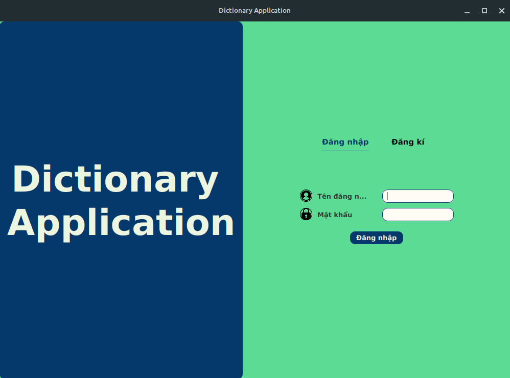

# DictionaryApplication

## Contributors

* [Nguyễn Đức Thiện (22021164)](https://github.com/ThienND04)
* [Phạm Minh Quý (22021199)](https://github.com/pmquy)
* [Lê Thái Sơn (22021185)](https://github.com/danhmatem)

## Introductions

Bài tập lớn số 1 - Ứng dụng học Tiếng Anh (UET OASIS - I2324 INT2204 1 - Lập trình hướng đối tượng)

* Ứng dụng được thiết kế để học Tiêng Anh. 
* Ứng dụng này được viết bằng Java và sử dụng thư viện JavaFX.
* Ứng dụng được thiết kế dựa trên mô hình MVC 
* Ứng dụng có các loại từ điển: 
  * Anh - Việt (cả bản online và offline)
  * Việt - Anh (bản online)

## Features

* Thêm, sửa, xóa từ khỏi từ điển cá nhân. 
* Tra cứu từ. 
* Phát âm tiếng Anh. 
* Dịch từ tiếng Anh sang tiếng Việt và ngược lại.
* Tích hợp 1 số loại game, giúp vừa học vừa chơi, tăng tính cạnh tranh giữa các người dùng
* Có cách thành tựu cho người dùng.
* Theme đa dạng

## Technologies 

* IntelliJ IDEA Community Edition 2022.2.2
* Scene Builder 21
* JavaFX 20.0.2
* CSS 
* Maven Framework
* Json 20231013 Library
* JSoup 1.16.2 HTML Parsers
* API Google Translate Anh <--> Việt 
* API Text to Speech 

## UML diagram 

## Installation

* Clone project về từ github.
* Mở project trong IDE 
* Run -> Edit Configurations -> Add new run configuration -> Application
    * Main class: Application 
    * Name: App

## Usage 

 <b> Tạo tài khoản </b> 
 

1. Bấm đăng kí 
2. Nhập tên đăng nhập (chưa được tồn tại) 
3. Nhập mật khẩu 
4. Xác nhận mật khẩu
5. Tạo 

 <b> Đăng nhập </b> 
 

1. Nhập tên đăng nhập (đã tồn tại)
2. Nhập mật khẩu
3. Đăng nhập

 <b> Dịch nghĩa </b> 
 

1. Chọn tab Dịch nghĩa
2. Chọn chế độ Anh - Việt hoặc Việt Anh 
3. Nhập từ cần dịch rồi bấm nút dịch 

 <b> Tra cứu từ điển </b> 
 

1. Chọn loại từ điển
   * Từ điển cá nhân 
   * Từ điển offline 
   * Từ điển online (dịch nghĩa)
2. Nhập từ cần tìm kiếm vào ô tìm kiếm 
3. Lúc này bên dưới sẽ hiện lên một số từ, sau đó chọn từ cần tra cứu

 <b> Thêm từ </b> 
 

1. Nhấn nút Thêm từ
2. Nhập từ và nghĩa của từ 
3. Bấm Add

 <b> Sửa từ </b> 
 

1. Chọn từ cần sửa
2. Nhấn nút Chỉnh sửa 
3. Sửa nội dung 
4. Nhấn Save 

 <b> Xóa từ </b> 
 

1. Chọn từ cần xóa 
2. Nhấn nút xóa và xác nhận 

 <b> Phát âm </b> 
 

1. Chọn từ 
2. Nhấn nút phát âm (biểu tượng loa)

 <b> Ôn tập </b> 
 

1. Chọn tab Ôn tập 
2. Chọn loại game 
3. Bấm new game để bắt đầu trò chơi 
4. Để thoát khỏi trò chơi bấm nút x

 <b> Quy tắc trò chơi </b> 
 

1. Game 1

    * Trò chơi gồm 10 câu hỏi. Để chiến thắng trò chơi phải trả lời tất cả các câu hỏi. Được phép sai tối đa 3 lần
    * Mỗi câu hỏi gồm 1 từ và 3 đáp án cần chọn (trong đó có 1 đáp án đúng). Chọn đáp án đúng và bấm vào nút kiếm tra
    * Để sử dụng Hint, nhấn nút Hint (biểu tượng bóng đèn phát sáng). Lưu ý chỉ được sử dụng tối đa 3 lần trong 1 trò chơi.
    * Điểm số trò chơi được tính là thời gian hoàn thành trò chơi (từ lúc bắt đầu trò chơi đến lúc chiến thắng)

2. Game 2 

    * Trò chơi gồm 10 cặp từ-nghĩa được sắp xếp một cách ngẫu nhiên. 
    * Chọn ra 1 cặp từ-nghĩa bằng cách bấm chuột vào chúng. Nếu đúng, chúng sẽ biến mất. 
    * Trò chơi sẽ chiến thắng khi làm mất toàn bộ các ô.
    * Để tạm dừng trò chơi, bấm pause. 
    * Điểm số trò chơi được tính là thời gian hoàn thành trò chơi (từ lúc bắt đầu trò chơi đến lúc chiến thắng)
    * Để nâng cao độ khó nên trò chơi này được thiết kế là không có hint. 

3. Game 3

    * Trò chơi gồm 5 câu hỏi.
    * Mỗi câu hỏi được cho sẵn nghĩa của từ và danh sách cách kí tự để tạo thành từ đó. 
    * Chọn chữ cái để ghép thành 1 từ. Các từ được chọn sẽ được đẩy lên trên, khi các từ được đẩy lên hết thì sẽ tự động kiểm tra đáp án, nếu đúng sẽ tự động tới câu tiếp theo, sai sẽ hiện ra Wrong ở rìa màn hình.
    * Sử dụng hint bằng cách bấm vào biểu tượng bóng đèn. Khi sử dụng hint, sẽ phát sáng nút nên bấm, nếu không phát sáng thì những chữ bạn chọn phía trước đã sai .Lưu ý chỉ được sử dụng tối đa 3 hint mỗi game.
    * Để tạm dừng trò chơi, bấm Dừng. 
    * Bấm nút Tiếp tục để chơi tiếp.
    * Điểm số trò chơi được tính là thời gian hoàn thành trò chơi (từ lúc bắt đầu trò chơi đến lúc chiến thắng)

 <b> Nhiệm vụ hằng ngày </b> 
 

* Thực hiện nhiệm vụ hằng ngày để lấy coin.
* Coin dùng để đổi lấy Hint trong shop.

 <b> Shop </b> 
 

* Avatar(cái ảnh hình tròn góc màn hình) -> Tài khoản 
* Bấm đổi để đổi vật phẩm tương ứng.

 <b> Đổi mật khẩu </b> 
 

* Avatar(cái ảnh hình tròn góc màn hình) -> Tài khoản
* Nhập mật khẩu hiện tại.
* Nhập mật khẩu hiện mới.
* Xác nhận mật khẩu hiện mới.
* Bấm đổi mật khẩu.

 <b> Đổi ảnh </b> 
 

* Avatar(cái ảnh hình tròn góc màn hình) -> Tài khoản
* Bấm đổi(biểu tượng cây bút)
* Chọn tệp tương ứng

 <b> Đổi theme </b> 
 

* Avatar(cái ảnh hình tròn góc màn hình) -> Cài Đặt -> Theme -> Chọn Theme

## Future improvements 

* Thêm các game hay hơn 
* Cải thiện giao diện người dùng 
* Sử dụng database để lưu dữ liệu 
* Cải thiện vấn đề bảo mật 
* Thêm 1 số thành tựu và giải thưởng 
* Tối ưu hóa khả năng tính điểm của trò chơi và bảng xếp hạng. 
* Người dùng có thể nạp tiền

## Preview

